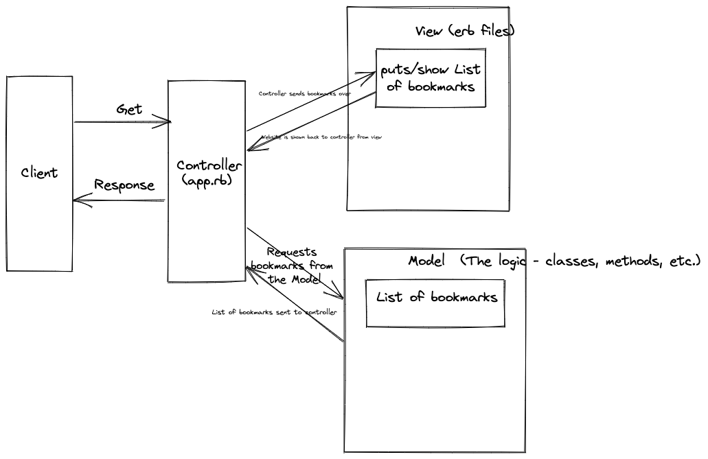

bookmark_manager specifications:

```
The website will have the following specifications:

Show a list of bookmarks
Add new bookmarks
Delete bookmarks
Update bookmarks
Comment on bookmarks
Tag bookmarks into categories
Filter bookmarks by tag
Users are restricted to manage only their own bookmarks
```
Database Instructions

1. Connect to psql
2. Create the database using the psql command CREATE DATABASE bookmark_manager;
3. Connect to the database using the pqsl command \c bookmark_manager;
4. Run the query we have saved in the file 01_create_bookmarks_table.sql

Test Database Instructions:

1. Connect to psql
2. Create the database using the psql command CREATE DATABASE bookmark_manager_test;
3. Connect to the database using the pqsl command \c bookmark_manager_test;
4. Run the query we have saved in the file 01_create_bookmarks_table.sql


```
User story 1:

As an internet user
In order to have quick access to websites I use frequently
I would like to access a list of website bookmarks
```
```
User story 2:

As and internet user
In order to revisit frequently used websites
I would like to add bookmarks to the list
```

Domain Model:


